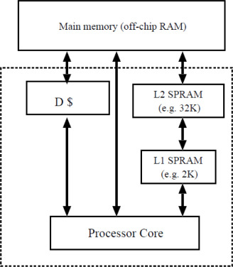
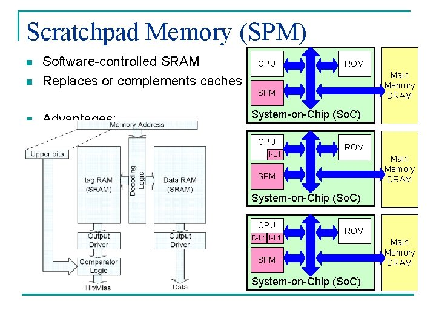
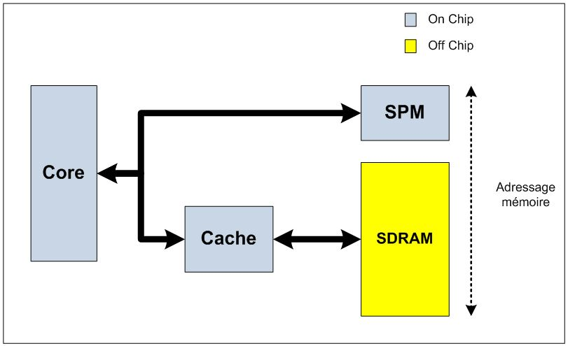

## Definition From Wikipedia

Scratchpad memory (SPM), also known as scratchpad, scratchpad RAM or local store in computer terminology, is a high-speed internal memory used for temporary storage of calculations, data, and other work in progress. In reference to a microprocessor ("CPU"), scratchpad refers to a special high-speed memory circuit used to hold small items of data for rapid retrieval. It is similar to the usage and size of a scratchpad in life: a pad of paper for preliminary notes or sketches or writings, etc.

In some systems it can be considered similar to the L1 cache in that it is the next closest memory to the ALU after the processor registers, with explicit instructions to move data to and from main memory, often using DMA-based data transfer. In contrast to a system that uses caches, a system with scratchpads is a system with non-uniform memory access latencies, because the memory access latencies to the different scratchpads and the main memory vary. Another difference from a system that employs caches is that a scratchpad commonly does not contain a copy of data that is also stored in the main memory.

Scratchpads are employed for simplification of caching logic, and to guarantee a unit can work without main memory contention in a system employing multiple processors, especially in multiprocessor system-on-chip for embedded systems. They are mostly suited for storing temporary results (as it would be found in the CPU stack) that typically wouldn't need to always be committing to the main memory; however when fed by DMA, they can also be used in place of a cache for mirroring the state of slower main memory. The same issues of locality of reference apply in relation to efficiency of use; although some systems allow strided DMA to access rectangular data sets. Another difference is that scratchpads are explicitly manipulated by applications. They may be useful for realtime applications, where predictable timing is hindered by cache behaviour.

Scratchpads are not used in mainstream desktop processors where generality is required for legacy software to run from generation to generation, in which the available on-chip memory size may change. They are better implemented in embedded systems, special-purpose processors and game consoles, where chips are often manufactured as MPSoC, and where software is often tuned to one hardware configuration.

## Definition From [Computational Frameworks 3.3.2](https://www.sciencedirect.com/topics/computer-science/scratchpad-memory)

Scratchpad memory (SPRAM) is a high-speed internal memory directly connected to the CPU core and used for temporary storage to hold very small items of data for rapid retrieval. Scratchpads are employed for simplification of caching logic and to guarantee a unit can work without main memory contention in a system employing multiple cores, especially in embedded MCSoC systems. They are suited to storing temporary results.

While a cache memory uses a complex hardware controller to decide which data to keep in cache memories (L1 or L2) and which data to prefetch, the SPRAM approach does not require any hardware support in addition to the memory itself, but requires software to take control of all data transfers to and from Scratchpad memories. It is therefore the responsibility of the programmer to identify data sections that should be placed in SPRAM or place code in the program to appropriately move data from on-chip memory to SPRAM. For this reason, SPRAMs are sometimes called “software controlled caches”. Figure 3.20 illustrates the memory subsystem architecture with two SPRAMs (levels 1 and 2).

Figure 3.20 MCSoC memory subsystem with SPRAM (only interconnection for one node is shown for simplicity)

Figure 3.20这张图L1/L2 SPRAM为什么会连接到Main memory? 这跟上文中提到的scratchpad memory和cache的区别不符合，反而更像是cache，下面这两张图是从google图片，更能够说明其定义。

